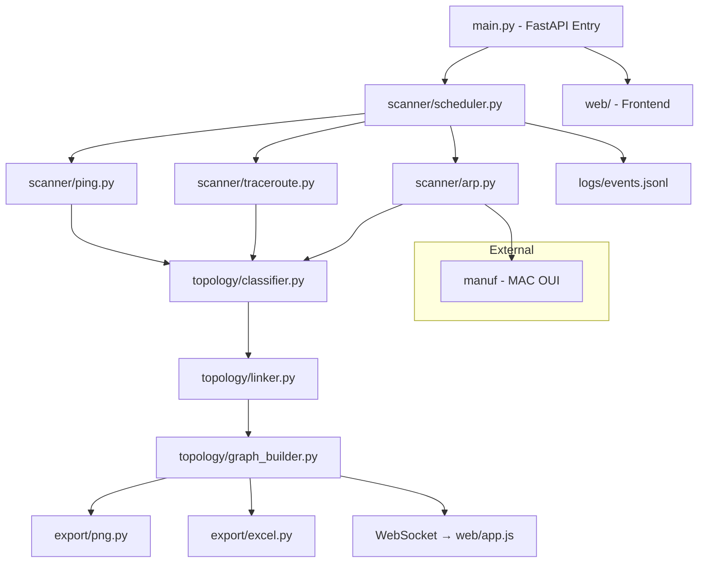
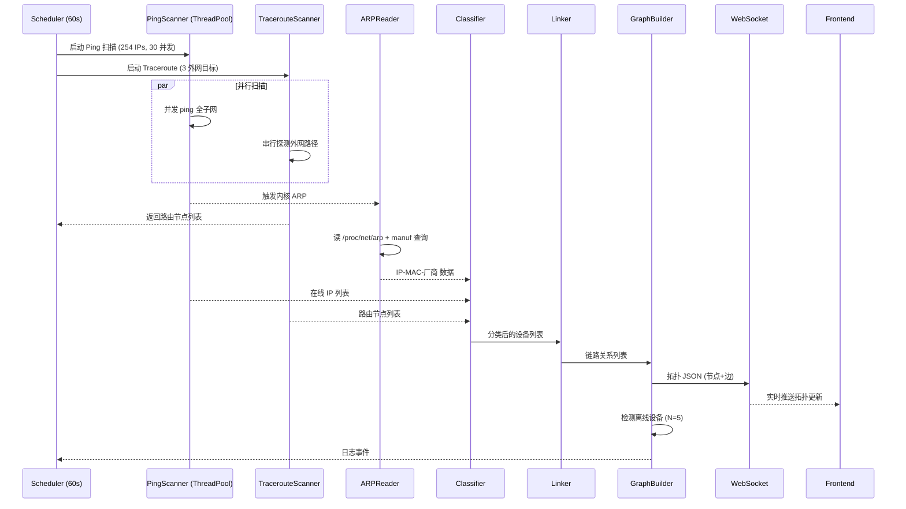
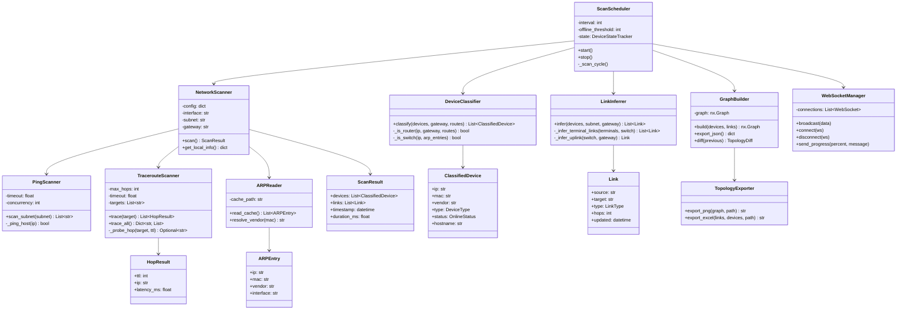

# Network Topology Discovery — 需求对齐文档

> 版本：v1.0 | 日期：2026-06-26 | 状态：已对齐

---

## 1. 项目概述

### 1.1 功能描述
基于 Python 的局域网二层+三层拓扑发现工具。通过 ARP、ICMP、Traceroute 协议探测子网内所有设备，推断终端-交换机-网关链路关系，并以交互式 Web 界面完成可视化。

### 1.2 设计目的
- 无需特权（no root）即可完成网络拓扑探测
- 支持后台周期性扫描，动态更新在线/离线设备状态
- 提供美观的交互式 Web 前端（Grafana / UniFi Controller 风格）
- 导出 PNG 拓扑图 + Excel 链路清单，满足课程报告要求

### 1.3 协议分工

| 协议 | 层级 | 分工 |
|------|------|------|
| **ARP** | 数据链路层（L2） | 通过 `/proc/net/arp` 获取 IP↔MAC 映射，厂商识别 |
| **ICMP Ping** | 网络层（L3） | 主机发现：扫描子网内所有在线终端 |
| **UDP Traceroute** | 网络层（L3） | 路由节点发现：通过 IP_RECVERR + MSG_ERRQUEUE 追踪报文路径 |

---

## 2. 环境与依赖

### 2.1 Conda 环境

| 参数 | 值 |
|------|-----|
| 环境名 | `netdiscover` |
| Python 版本 | 3.12 |
| 路径 | `/data/conda_envs/netdiscover` |

### 2.2 依赖包清单

| 包名 | 用途 | 安装方式 |
|------|------|----------|
| `fastapi` | Web 后端框架 | conda-forge |
| `uvicorn[standard]` | ASGI 服务器 | conda-forge |
| `websockets` | WebSocket 实时推送 | conda-forge |
| `networkx` | 拓扑图数据结构 | conda-forge |
| `matplotlib` | 拓扑图静态渲染（PNG） | conda-forge |
| `openpyxl` | Excel 链路清单导出 | conda-forge |
| `numpy` | 数值计算 | conda-forge |
| `manuf` | MAC 厂商 OUI 查询 | pip |
| `pyyaml` | 配置文件解析 | conda-forge |
| `jinja2` | HTML 模板渲染 | conda-forge |
| `python-multipart` | FastAPI 文件支持 | conda-forge |

### 2.3 前端依赖（CDN 引入，无构建）

| 库 | 版本 | 用途 |
|-----|------|------|
| `vis-network` | 9.x | 交互式拓扑图（拖拽、缩放、点击详情） |
| `vis-data` | 7.x | vis-network 数据层 |
| `Chart.js` | 4.x | 仪表盘统计图表 |
| Google Fonts (Inter) | — | 字体 |

### 2.4 无 Root 权限约束

- **禁止**使用 Scapy 发原始 ARP/ICMP 包
- **ARP 扫描**：并发 ping 全子网 → 内核自动触发 ARP → 读 `/proc/net/arp`
- **Traceroute**：Python UDP socket + `IP_RECVERR` (raw=11) + `MSG_ERRQUEUE` (0x2000)
- **ICMP Ping**：`subprocess` 调用系统 `ping` 命令
- `/proc/net/arp` 已确认可读（无需特权）

---

## 3. 网络环境

### 3.1 目标网络

| 参数 | 值 |
|------|-----|
| 主机名 | cadmin |
| 活跃网卡 | `eno2` |
| 本机 IP | `10.15.117.85`（DHCP） |
| 子网掩码 | `255.255.255.0`（/24） |
| 网段 | `10.15.117.0/24` |
| 扫描范围 | 254 个 IP（.1 ~ .254） |
| 默认网关 | `10.15.117.1` |
| MAC 地址（eno2） | `3c:ec:ef:9a:c6:01` |

### 3.2 网段自动检测

- `config.yaml` 中 `interface: auto` → 启动时自动检测活跃网卡、IP、子网掩码、网关
- DHCP IP 变更时自动适配
- 手动指定网卡：`interface: eno2`

### 3.3 接口绑定

- FastAPI 同时监听 `127.0.0.1`（本机）和 `0.0.0.0`（局域网可访问）
- 默认端口：`8080`

---

## 4. 扫描参数

### 4.1 周期配置

| 参数 | 值 | 说明 |
|------|-----|------|
| 扫描间隔 | 60 秒 | 后台定时触发 |
| 离线判定阈值 N | 5 次 | 连续 5 次不可达 → 标记离线 |
| Ping 超时 | 1 秒 | 单次 ping 超时 |
| Ping 并发数 | 30 | 同时进行的 ping 进程数 |
| Traceroute 超时 | 3 秒 | 单跳超时 |
| Traceroute 最大跳数 | 30 | 最大 TTL |

### 4.2 外网 Traceroute 目标

```
- 8.8.8.8        (Google DNS)
- 114.114.114.114 (国内 DNS)
- 1.1.1.1        (Cloudflare DNS)
```

---

## 5. 设备分类逻辑

| 设备类型 | 图标 | 颜色 | 判断依据 |
|---------|------|------|---------|
| **路由器/网关** | 🔷 菱形 | #FF6B6B (红) | 默认网关 OR traceroute 中间节点 OR 同 MAC 对应多 IP |
| **交换机** | 🔶 正方形 | #FFD93D (黄) | 虚拟节点：同网段终端的汇聚点（二层透明，不可直接发现） |
| **终端** | 🖥️ 圆形 | #6BCB77 (绿) | 其余所有活跃 IP（排除网关、本机、交换机虚拟节点） |
| **本机** | ⭐ 星形 | #4D96FF (蓝) | `10.15.117.85` |

### 交换机虚拟节点规则

- 每个 /24 网段至少一个交换机虚拟节点
- 所有终端连接到该交换机
- 交换机上联到网关
- ARP 表中同 MAC 对应多 IP → 可能是交换机管理接口，升级为真实交换机节点

---

## 6. 链路关系推断

### 6.1 链路规则

```
[终端] ──(L2 直连)──> [交换机] ──(L2 直连)──> [网关/路由器] ──(L3 路由)──> [外网]
```

### 6.2 推断依据

1. **终端 ↔ 交换机**：同一子网内，共享广播域
2. **交换机 ↔ 网关**：ARP 表中网关 MAC 存在，同网段
3. **网关 ↔ 上游路由**：traceroute 到外网目标的中间节点

### 6.3 链路属性

| 属性 | 值 |
|------|-----|
| 链路类型 | `L2_DIRECT` / `L3_ROUTE` |
| 跳数 | 1（同子网）/ N（traceroute 跳数） |
| 更新时间 | ISO-8601 时间戳 |

---

## 7. 模块架构

### 7.1 目录结构

```
NetworkTopologyDiscovery/
├── README.md                 # GitHub 规范 README
├── LICENSE                   # MIT License
├── requirements.txt          # pip 依赖
├── config.yaml               # 扫描参数、主题配置
├── main.py                   # FastAPI 入口
├── scanner/
│   ├── __init__.py
│   ├── ping.py               # ICMP Ping 并发扫描
│   ├── traceroute.py         # UDP Traceroute（IP_RECVERR + MSG_ERRQUEUE）
│   ├── arp.py                # ARP 缓存读取 + manuf 厂商查询
│   └── scheduler.py          # 60s 周期调度 + 离线检测
├── topology/
│   ├── __init__.py
│   ├── classifier.py         # 设备分类（终端/交换机/路由器/本机）
│   ├── linker.py             # 链路关系推断
│   └── graph_builder.py      # networkx 图构建 + 拓扑数据生成
├── export/
│   ├── __init__.py
│   ├── png.py                # matplotlib 拓扑图渲染
│   └── excel.py              # openpyxl 链路清单导出
├── web/
│   ├── static/
│   │   ├── style.css         # Grafana/UniFi 混合主题（亮/暗切换）
│   │   └── app.js            # vis-network 交互前端 + WebSocket 客户端
│   └── templates/
│       └── index.html        # 主页面模板
├── docs/
│   └── REQUIREMENTS.md       # 本文档
├── logs/                     # 事件日志（JSON Lines 格式）
│   └── events.jsonl
└── output/                   # 导出文件
    ├── topology.png          # 拓扑图 PNG
    └── links.xlsx            # 链路清单 Excel
```

### 7.2 模块依赖图（Mermaid）



### 7.3 并发流程图（Mermaid）



### 7.4 类图（Mermaid）



---

## 8. 前端设计

### 8.1 技术栈

- **vis-network**：交互式拓扑图（拖拽节点、缩放、点击查看详情）
- **vis-data**：vis-network 数据管理
- **Chart.js**：仪表盘统计（在线/离线/设备类型分布）
- **原生 CSS**：Grafana + UniFi Controller 混合风格

### 8.2 页面布局

```
┌──────────────────────────────────────────────────┐
│  🔍 Network Topology Discovery    [☀️/🌙] [⏸️/▶️] │  ← 顶部导航栏
├──────────┬───────────────────────┬───────────────┤
│          │                       │  Device Info  │
│  Stats   │    Topology Graph     │  ───────────  │
│  Cards   │    (vis-network)      │  IP: ...      │
│          │                       │  MAC: ...     │
│  Online  │    ┌───┐              │  Vendor: ...  │
│   42     │    │ R │────┐         │  Type: ...    │
│          │    └───┘    │         │  Status: ...  │
│  Offline │         ┌───┴──┐      │               │
│   3      │         │  SW  │      │  [Export PNG] │
│          │         └──┬───┘      │  [Export XLSX]│
│  Routers │       ┌────┼────┐     │               │
│   1      │     ┌─┴─┐┌─┴─┐┌─┴─┐  │               │
│          │     │PC1││PC2││PC3│  │               │
│  Switches│     └───┘└───┘└───┘  │               │
│   1      │                       │               │
│          │                       │               │
│  Endpoints│                      │               │
│   10     │                       │               │
├──────────┴───────────────────────┴───────────────┤
│  Event Log: [12:00] Device 10.15.117.49 online   │  ← 底部日志流
└──────────────────────────────────────────────────┘
```

### 8.3 主题

- **亮色模式**：白色背景，UniFi 风格的浅灰卡片 + 蓝色强调色
- **暗色模式**：深色背景（#1a1a2e），Grafana 风格的半透明面板 + 青色强调色
- 默认暗色，localStorage 记忆用户选择

### 8.4 交互功能

| 功能 | 实现 |
|------|------|
| 拖拽节点 | vis-network 原生支持 |
| 缩放平移 | vis-network 原生支持 |
| 点击节点 | 右侧面板显示设备详情 |
| 双击节点 | 高亮该设备所有链路 |
| 主题切换 | ☀️/🌙 按钮，即时切换 CSS 变量 |
| 扫描控制 | ⏸️/▶️ 按钮，暂停/恢复周期扫描 |
| 导出按钮 | PNG 拓扑图、XLSX 链路清单 |
| 进度条 | 顶部线形进度条（WebSocket 推送扫描进度） |
| 实时更新 | WebSocket 推送设备上线/下线事件 |

---

## 9. 数据导出

### 9.1 链路清单 Excel

| 列名 | 类型 | 说明 |
|------|------|------|
| 源设备IP | str | 链路起点 IP |
| 源MAC | str | 链路起点 MAC |
| 源厂商 | str | MAC OUI 厂商 |
| 源设备类型 | str | 终端/交换机/路由器 |
| 目标设备IP | str | 链路终点 IP |
| 目标MAC | str | 链路终点 MAC |
| 目标厂商 | str | MAC OUI 厂商 |
| 目标设备类型 | str | 终端/交换机/路由器 |
| 链路类型 | str | L2_DIRECT / L3_ROUTE |
| 跳数 | int | 链路跳数 |
| 更新时间 | datetime | ISO-8601 |

### 9.2 拓扑图 PNG

- 使用 `matplotlib` + `networkx` 布局
- 节点形状区分设备类型
- 颜色标注在线/离线状态
- 边标注链路类型
- 分辨率：1920×1080, DPI 150

---

## 10. 日志系统

### 10.1 日志格式

JSON Lines（`logs/events.jsonl`），每行一条事件：

```json
{"timestamp": "2026-06-26T12:00:00+08:00", "level": "INFO", "event": "device_online", "ip": "10.15.117.49", "mac": "80:ce:62:f1:5a:31"}
{"timestamp": "2026-06-26T12:00:00+08:00", "level": "WARN", "event": "device_offline", "ip": "10.15.117.28", "consecutive_misses": 5}
{"timestamp": "2026-06-26T12:00:00+08:00", "level": "INFO", "event": "scan_complete", "duration_ms": 3421, "online": 12, "offline": 3}
```

### 10.2 事件类型

| 事件 | 级别 | 触发条件 |
|------|------|---------|
| `scan_start` | INFO | 每次扫描周期开始 |
| `scan_complete` | INFO | 扫描周期完成 |
| `device_online` | INFO | 设备从离线变为在线 |
| `device_offline` | WARN | 连续 N=5 次不可达 |
| `device_discovered` | INFO | 新发现的设备 |
| `topology_changed` | INFO | 链路关系变更 |
| `scan_error` | ERROR | 扫描过程异常 |

---

## 11. 升级接口设计

为后续升级保留的扩展点：

| 接口 | 位置 | 扩展方式 |
|------|------|---------|
| 扫描器插件 | `scanner/` | 添加新协议扫描器（如 LLDP、SNMP），继承 `BaseScanner` |
| 分类器规则 | `topology/classifier.py` | `DeviceClassifier` 支持动态注册分类规则 |
| 导出格式 | `export/` | 添加 `csv.py`、`json.py` 等，继承 `BaseExporter` |
| 前端组件 | `web/static/app.js` | 模块化 JS，可扩展图表、告警面板 |
| 配置扩展 | `config.yaml` | 新增扫描参数、主题变量、外网目标无需改代码 |
| 日志后端 | `logs/` | 可切换 SQLite / Elasticsearch 存储 |

---

## 12. 验收标准

### 12.1 功能验收

- [x] ~~主机发现：ARP + ICMP ping 扫描 /24 网段，覆盖所有在线终端~~ → 等待实现
- [x] ~~路由节点发现：UDP Traceroute 发现网关和上游路由~~ → 等待实现
- [x] ~~MAC 获取：读 /proc/net/arp + manuf 厂商查询~~ → 等待实现
- [x] ~~链路推断：终端→交换机→网关 三段链路~~ → 等待实现
- [x] ~~拓扑图：networkx + matplotlib 静态图 + vis-network 交互图~~ → 等待实现
- [x] ~~结果导出：PNG 拓扑图 + Excel 链路清单~~ → 等待实现
- [x] ~~后台扫描：60s 周期，N=5 离线检测~~ → 等待实现
- [x] ~~设备分类：终端/交换机/路由器~~ → 等待实现
- [x] ~~交互界面：拖拽、缩放、点击详情~~ → 等待实现

### 12.2 技术验收

- [x] ~~无需 root 权限运行~~ → 等待实现
- [x] ~~纯 Python traceroute（IP_RECVERR + MSG_ERRQUEUE）~~ → 等待验证
- [x] ~~并发 ping 扫描，不触发防火墙限制~~ → 等待实现
- [x] ~~WebSocket 实时推送，不轮询~~ → 等待实现
- [x] ~~亮/暗主题切换 + localStorage 记忆~~ → 等待实现

### 12.3 报告验收

- [x] ~~程序介绍：功能描述 + 协议分工~~ → 等待实现
- [x] ~~程序结构：模块依赖图、并发流程图、类图（Mermaid）~~ → 已设计（本文档 §7）
- [x] ~~程序源码：完整代码 + 超时参数说明~~ → 等待实现
- [x] ~~运行测试：宿舍局域网完整拓扑结构图~~ → 等待实现

---

## 13. 开发流程

### 13.1 Subagent 协作模式

```
Phase 1: [code-agent: scanner/] → [test-agent: scanner/] → 评审 → 修改 → 通过
Phase 2: [code-agent: topology/] → [test-agent: topology/] → 评审 → 修改 → 通过
Phase 3: [code-agent: export/] → [test-agent: export/] → 评审 → 修改 → 通过
Phase 4: [code-agent: web/] → [test-agent: web/] → 评审 → 修改 → 通过
Phase 5: [code-agent: main.py + config] → [test-agent: 集成测试] → 评审 → 修改 → 通过
```

每个 Phase：
1. code-agent 实现模块
2. test-agent 独立验证功能 + 提出评判意见
3. code-agent 根据反馈修改
4. 循环至通过

### 13.2 编码前 Checklist

- [x] 需求对齐文档完成（本文档）
- [ ] Conda 环境 `netdiscover` 创建 + 依赖安装
- [ ] README.md 编写
- [ ] config.yaml 模板创建
- [ ] 目录结构初始化

---

## 14. 变更记录

| 日期 | 版本 | 变更说明 |
|------|------|---------|
| 2026-06-26 | v1.0 | 初始需求对齐，基于 grill-me 访谈 |
